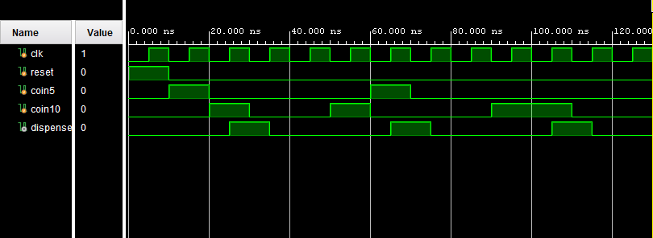

# Vending Machine Controller using Verilog FSM

This project implements a Vending Machine Controller using a Finite State Machine (FSM) in Verilog HDL. The vending machine accepts ₹5 and ₹10 coins and dispenses a product when the total inserted amount reaches or exceeds ₹15.

The design was simulated and verified using Xilinx Vivado.

---

## Features

- Accepts ₹5 and ₹10 coins
- Product cost is ₹15
- Generates a dispense signal when sufficient money is inserted
- Implemented using FSM concepts
- Verified through behavioral simulation

---

## Tools Used

- Verilog HDL
- Xilinx Vivado
- Behavioral Simulation

---

# FSM States

| State | Amount |
|---------|---------|
| S0 | ₹0 |
| S5 | ₹5 |
| S10 | ₹10 |

---

# State Transition Diagram

```text
S0 (₹0)
│
├── coin5  → S5
└── coin10 → S10

S5 (₹5)
│
├── coin5  → S10
└── coin10 → DISPENSE

S10 (₹10)
│
├── coin5  → DISPENSE
└── coin10 → DISPENSE
```

After dispensing the product, the machine returns to the initial state.

---

# Verilog Code

## vending_machine.v

```verilog
module vending_machine(
    input clk,
    input reset,
    input coin5,
    input coin10,
    output reg dispense
);

reg [1:0] state;

parameter S0  = 2'b00;
parameter S5  = 2'b01;
parameter S10 = 2'b10;

always @(posedge clk or posedge reset)
begin
    if(reset)
    begin
        state <= S0;
        dispense <= 0;
    end
    else
    begin
        dispense <= 0;

        case(state)

            S0:
            begin
                if(coin5)
                    state <= S5;
                else if(coin10)
                    state <= S10;
            end

            S5:
            begin
                if(coin5)
                    state <= S10;
                else if(coin10)
                begin
                    state <= S0;
                    dispense <= 1;
                end
            end

            S10:
            begin
                if(coin5 || coin10)
                begin
                    state <= S0;
                    dispense <= 1;
                end
            end

        endcase
    end
end

endmodule
```

---

# Testbench

## vending_machine_tb.v

```verilog
`timescale 1ns / 1ps

module vending_machine_tb;

reg clk;
reg reset;
reg coin5;
reg coin10;

wire dispense;

vending_machine uut(
    .clk(clk),
    .reset(reset),
    .coin5(coin5),
    .coin10(coin10),
    .dispense(dispense)
);

always #5 clk = ~clk;

initial
begin
    clk = 0;
    reset = 1;
    coin5 = 0;
    coin10 = 0;

    #10;
    reset = 0;

    // Test Case 1 : ₹5 + ₹10
    coin5 = 1; #10;
    coin5 = 0;

    coin10 = 1; #10;
    coin10 = 0;

    // Test Case 2 : ₹10 + ₹5
    #20;
    coin10 = 1; #10;
    coin10 = 0;

    coin5 = 1; #10;
    coin5 = 0;

    // Test Case 3 : ₹10 + ₹10
    #20;
    coin10 = 1; #10;
    coin10 = 0;

    coin10 = 1; #10;
    coin10 = 0;

    #20;

    $finish;
end

endmodule
```

---

# Simulation Waveform



---

# Waveform Analysis

The waveform verifies the operation of the vending machine controller for different coin combinations.

### Test Case 1: ₹5 + ₹10

Coins inserted:

```text
₹5 + ₹10 = ₹15
```

Result:

```text
dispense = 1
```

The product is dispensed when the total amount reaches ₹15.

---

### Test Case 2: ₹10 + ₹5

Coins inserted:

```text
₹10 + ₹5 = ₹15
```

Result:

```text
dispense = 1
```

The product is dispensed after the required amount is accumulated.

---

### Test Case 3: ₹10 + ₹10

Coins inserted:

```text
₹10 + ₹10 = ₹20
```

Result:

```text
dispense = 1
```

Since the inserted amount exceeds the product cost, the product is dispensed.

---

# Verification Summary

| Coin Sequence | Total Amount | Dispense |
|--------------|-------------|----------|
| ₹5 + ₹10 | ₹15 | Yes |
| ₹10 + ₹5 | ₹15 | Yes |
| ₹10 + ₹10 | ₹20 | Yes |

---

# Applications

- Automated Vending Machines
- Ticket Dispensing Systems
- Coin-Based Access Systems
- FSM-Based Embedded Controllers
- Digital Payment Systems

---

# Learning Outcomes

This project demonstrates:

- Finite State Machine (FSM) Design
- State Transition Modeling
- Sequential Logic Design
- Control Logic Implementation
- Verilog HDL Coding
- Behavioral Simulation
- Waveform Verification

---

# Conclusion

The Vending Machine Controller was successfully implemented using a Finite State Machine in Verilog HDL. The system correctly accepts ₹5 and ₹10 coins, tracks the accumulated amount through state transitions, and generates a dispense signal whenever the required amount of ₹15 or more is reached. Simulation results verify the correct functionality of the design.

---

## Repository Structure

```text
│
├── vending_machine.v
├── vending_machine_tb.v
├── waveform.png
└── README.md
```

---

## Author

**Farhana N S**  
Electronics Engineering Student  
Verilog HDL | Digital Design | VLSI Enthusiast
